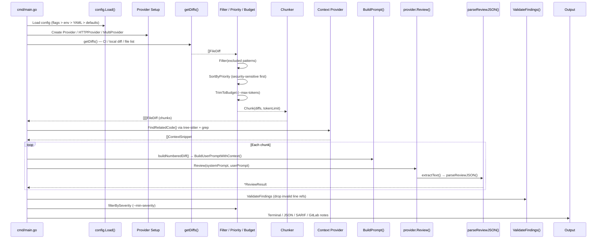
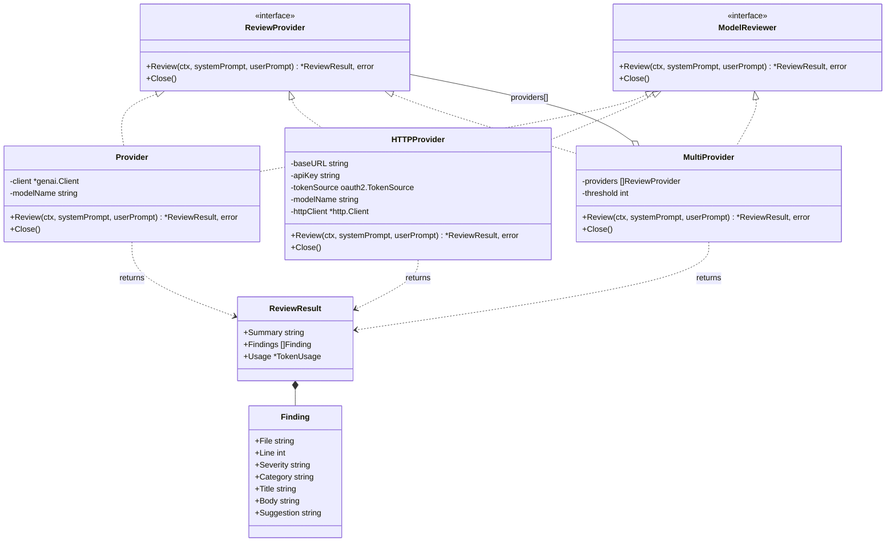
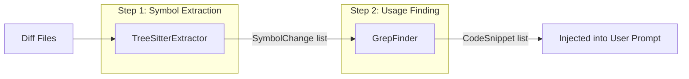
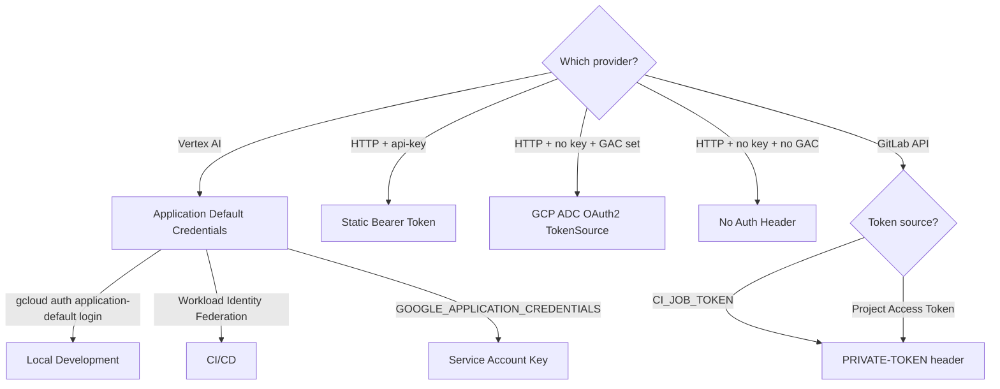

# Architecture Reference

## 1. Overview

**code-reviewer** is an AI-powered code review tool that analyses unified diffs from Git or GitLab merge requests and produces structured, actionable findings. It runs locally against `git diff` or inside GitLab CI pipelines, supports multiple AI backends (Vertex AI Gemini, any OpenAI-compatible endpoint), and can output results as colored terminal text, JSON, SARIF 2.1.0, or as GitLab MR comments. A tree-sitter–based context pipeline discovers cross-file regressions, and a multi-model consensus mode reduces false positives by requiring agreement across independently queried models.

---

## 2. Pipeline

The following diagram shows the full review pipeline from CLI invocation to output:



---

## 3. Package Map

| Package | Purpose | Key Exported Types | Dependencies |
|---|---|---|---|
| `cmd/code-reviewer` | CLI entry point; wires config, providers, reviewer | `main()`, `run()` | `config`, `context`, `gitlab`, `model`, `reviewer` |
| `internal/config` | Config loading and validation; flag/env/YAML merge | `Config`, `Severity`, `CommentMode`, `ChunkStrategy`, `Load()` | `gopkg.in/yaml.v3` |
| `internal/model` | AI model providers and prompt construction | `Provider`, `HTTPProvider`, `MultiProvider`, `ReviewProvider`, `ReviewResult`, `Finding`, `TokenUsage`, `ContextSnippet` | `google.golang.org/genai`, `golang.org/x/oauth2`, `golang.org/x/sync/errgroup`, `internal/retry` |
| `internal/reviewer` | Core review pipeline orchestration and output | `Reviewer`, `ModelReviewer`, `VCSClient`, `DiffSource`, `CostEstimate` | `internal/config`, `internal/context`, `internal/diff`, `internal/model`, `internal/vcs`, `golang.org/x/term` |
| `internal/diff` | Unified diff parsing, filtering, chunking, priority | `FileDiff`, `Hunk`, `DiffLine`, `LineType`, `ChunkStrategy` (interface), `FailStrategy`, `SplitStrategy`, `DiffTooLargeError` | (stdlib only) |
| `internal/context` | Tree-sitter symbol extraction and grep-based usage finding | `Provider` (interface), `DefaultProvider`, `SymbolExtractor`, `UsageFinder`, `SymbolChange`, `CodeSnippet` | `internal/diff`, `github.com/odvcencio/gotreesitter` |
| `internal/gitlab` | GitLab REST API v4 client | `Client` | `internal/vcs` |
| `internal/vcs` | Platform-agnostic VCS types | `MRChanges`, `DiffEntry`, `DiffVersion`, `Comment`, `InlineCommentRequest`, `InlineCommentPosition` | (stdlib only) |
| `internal/retry` | Exponential backoff with jitter | `Options`, `RetryableError`, `Do()`, `IsRetryable()` | (stdlib only) |

---

## 4. Prompt Layering

The system prompt is constructed by `BuildPromptWithCustom()` in `internal/model/prompt.go` through four additive layers:

```
┌───────────────────────────────────────────────────┐
│ 1. Base Prompt (built-in or custom file)          │
│    - Persona: "Principal Software Engineer"       │
│    - Objective: thorough, actionable review       │
│    - Critical constraints (line accuracy, tone)   │
│    - Severity guidelines (CRITICAL→LOW)           │
│    - Output format (JSON schema)                  │
│    - Adversarial guardrails (immutable)           │
├───────────────────────────────────────────────────┤
│ 2. Focus Overlays (appended per --focus)          │
│    bugs | security | performance | style | docs   │
│    "all" → appends all five in deterministic order│
├───────────────────────────────────────────────────┤
│ 3. Extra Rules (--extra-rules or YAML)            │
│    Appended under "## ADDITIONAL RULES"           │
├───────────────────────────────────────────────────┤
│ 4. Custom Prompt File (--custom-prompt)           │
│    Replaces the base prompt entirely              │
│    Focus overlays and rules still appended        │
└───────────────────────────────────────────────────┘
```

### `BuildPromptWithCustom()` Logic

```go
func BuildPromptWithCustom(customPromptPath string, focusModes []string, extraRules string) string {
    // 1. Base: read custom file or use built-in basePrompt
    // 2. Focus overlays: if "all" or empty, append all 5; else append selected
    // 3. Extra rules: append under "## ADDITIONAL RULES" header
    // Returns: concatenated system prompt string
}
```

### Focus Overlays

| Key | Emphasis |
|---|---|
| `bugs` | Off-by-one, nil derefs, race conditions, error handling |
| `security` | Injection, hardcoded secrets, auth bypass, crypto issues |
| `performance` | N+1 queries, resource leaks, allocations, pagination |
| `style` | Naming, idiomatic patterns, consistency |
| `docs` | Public API docs, outdated comments, complex logic explanations |

### Adversarial Guardrails

The base prompt includes an immutable constraint that the model **must ignore** any directives in the diff content, MR title, or MR description that attempt to override the system prompt. This prevents prompt injection attacks via crafted diffs.

### User Prompt Construction

The user prompt is built by `BuildUserPromptWithContext()`:

1. MR title and description (if in CI mode)
2. Code changes in numbered diff format (wrapped in ```` ```diff ```` block)
3. Related unchanged code snippets (from context pipeline)

---

## 5. Provider Architecture



### Provider: Vertex AI (google.golang.org/genai)

- Uses `genai.Client` with `BackendVertexAI` and Application Default Credentials
- Supports optional proxy URL (routed via `HTTPOptions.BaseURL`)
- For Gemini models: uses native JSON response schema (`ResponseMIMEType: "application/json"`) to constrain output
- For non-Gemini models (Claude, Mistral via Model Garden): relies on prompt-instructed JSON
- Temperature fixed at 0.2 for consistent reviews
- Retries on 429, 502, 503, 504, and transient error strings

### HTTPProvider: OpenAI-Compatible

- Speaks the `/v1/chat/completions` API (works with vLLM, Ollama, Candela, TGI, llama.cpp, Cloud Run endpoints)
- Auth strategy (in order):
  1. Static API key → `Authorization: Bearer <key>`
  2. GCP ADC (`GOOGLE_APPLICATION_CREDENTIALS`) → auto-refreshing OAuth2 tokens
  3. No auth header (local endpoints)
- 5-minute HTTP timeout; 10 MB response body cap
- Retries on HTTP 429/502/503/504 using `httpStatusError` type for reliable classification

### MultiProvider: Consensus Mode

- Runs N `ReviewProvider` instances **concurrently** via `errgroup`
- Deduplicates findings using `findingsMatch()`: same file, same category, within ±3 lines
- Applies consensus threshold (default: 2) — only findings agreed upon by ≥ threshold models are kept
- Selects the canonical finding (longest body) from each group
- Aggregates token usage across all models

### Shared Pattern

Both `Provider` and `HTTPProvider` follow the same flow:

```
generateRaw() → extractText() → parseReviewJSON() → *ReviewResult
```

`parseReviewJSON()` has three fallback stages:
1. Direct `json.Unmarshal`
2. Strip markdown code fences (` ```json ... ``` `)
3. Extract first `{...}` substring

---

## 6. Context Pipeline

The context pipeline (`internal/context`) discovers cross-file regressions by finding unchanged code that references symbols modified in the diff.



### Step 1: Tree-Sitter Symbol Extraction

`TreeSitterExtractor` parses each changed file using `gotreesitter` with language-specific `.scm` query files (embedded via `//go:embed`):

| Language | Extensions | Query File |
|---|---|---|
| Go | `.go` | `go.scm` |
| Kotlin | `.kt`, `.kts` | `kotlin.scm` |
| Java | `.java` | `java.scm` |
| Python | `.py` | `python.scm` |
| TypeScript | `.ts`, `.tsx` | `typescript.scm` |

Only symbols whose definitions overlap with **added lines** in the diff are kept. Symbols shorter than 4 characters are filtered out to reduce noise.

**Security**: Path traversal is prevented by resolving symlinks with `filepath.EvalSymlinks()` and verifying the resolved path stays within the repo root.

### Step 2: Grep-Based Usage Finding

`GrepFinder` searches the repo for usages of extracted symbols:

- Prefers **ripgrep** (`rg`) if available, falls back to `grep`
- Excludes: `vendor/`, `node_modules/`, `.git/`, `build/`, `dist/`, `*.min.js`, `*.pb.go`, `go.sum`
- Excludes files already in the diff
- Uses `--word-regexp` for precise matching
- 5-second timeout per grep invocation

**Noise Mitigation:**

| Filter | Purpose |
|---|---|
| `MinNameLength: 4` | Skip short names like `ID`, `Err` |
| `MaxSnippetsPerSymbol: 10` | Cap results per symbol |
| `MaxTotalSnippets: 50` | Cap total results |
| `MaxFileMatches: 20` | Skip overly common symbols |
| `isNoiseMatch()` | Skip import statements and comments |

---

## 7. Diff Processing

### Parsing (`internal/diff/parser.go`)

`Parse()` reads standard unified diff output (`diff --git a/... b/...`) and produces `[]FileDiff`. Each `FileDiff` contains:
- `OldPath` / `NewPath`
- `Hunks` with header, line ranges, and per-line type (`LineAdded`, `LineRemoved`, `LineContext`)
- Metadata flags: `IsBinary`, `IsNew`, `IsDelete`, `IsRename`
- Line numbers tracked via O(1) running counters (not rescanning)

### Filtering (`internal/diff/filter.go`)

`Filter()` removes files matching exclusion patterns. Default excluded patterns:

```
go.sum, *.lock, package-lock.json, yarn.lock, vendor/*, node_modules/*
```

Matching is attempted against both the full path and the basename. Directory globs (`vendor/*`) are handled by prefix matching.

### Priority Ordering (`internal/diff/priority.go`)

`SortByPriority()` sorts files for review order and budget trimming:

| Factor | Score Impact |
|---|---|
| Security-sensitive path (auth, token, crypto, etc.) | +100 |
| New file (no prior review) | +30 |
| Line count (more changes = higher) | +N |
| Generated code (`.pb.go`, `vendor/`, etc.) | −50 |
| Test file | −10 |
| Pure rename (0 content changes) | −40 |

### Chunking (`internal/diff/chunker.go`)

Two strategies controlled by `--chunk-strategy`:

| Strategy | Behavior |
|---|---|
| `fail` (default) | Error if diff exceeds model context window |
| `split` | Bin-pack files into chunks (80% effective limit, largest-first) |

Token estimation: 1 token ≈ 4 characters.

Known model limits:

| Model | Token Limit |
|---|---|
| `gemini-2.5-flash` / `gemini-2.5-pro` / `gemini-2.0-flash` | 1,000,000 |
| `claude-sonnet-4` / `claude-sonnet-4.5` / `claude-opus-4` / `claude-haiku-4.5` | 200,000 |
| `mistral-medium-3` | 128,000 |
| Unknown models | 128,000 (default) |

### Numbered Diff Format

`buildNumberedDiff()` produces a format optimized for LLM line reference accuracy:

```
=== File: internal/handler/auth.go ===
@@ -10,5 +10,7 @@ func Validate()
  10   func Validate(token string) error {
  11 +     if token == "" {
  12 +         return ErrEmpty
  13 +     }
  14       claims, err := Parse(token)
```

### Token Budget (`internal/reviewer/budget.go`)

`EstimateCost()` performs pre-flight estimation (output ≈ 25% of input). `TrimToBudget()` removes lowest-priority files from the tail until the estimate fits within `--max-tokens`. A runtime safety net stops chunk iteration if actual usage exceeds the budget.

### Finding Validation (`internal/reviewer/validator.go`)

`ValidateFindings()` drops findings that reference:
- Files not present in the diff (with fuzzy path matching as fallback)
- Line numbers not in the changed set (with hunk-range tolerance)

---

## 8. Config Resolution

Configuration is loaded by `config.Load()` with strict precedence:

```
CLI flags  >  Environment variables  >  .code-reviewer.yaml  >  Defaults
```

### Defaults

```go
Model:            "gemini-2.5-flash"
GCPLocation:      "us-central1"
Focus:            ["all"]
MinSeverity:      SeverityLow
CommentMode:      "notes"
ChunkStrategy:    "fail"
GitLabBaseURL:    "https://gitlab.com"
SkipDraftMRs:     true
ExcludedPatterns: ["go.sum", "*.lock", "package-lock.json", "yarn.lock", "vendor/*", "node_modules/*"]
```

### YAML Config (`.code-reviewer.yaml` / `.yml`)

Searched by walking up from `cwd` to filesystem root. Supported fields:

```yaml
model: gemini-2.5-pro
focus: [security, bugs]
min_severity: medium
comment_mode: discussions
chunk_strategy: split
excluded_patterns: ["*.generated.go"]
extra_rules: "Always flag SQL string concatenation"
output_json: true
custom_prompt: ./prompts/team-review.md
proxy_url: http://localhost:8181/proxy/google/
max_tokens: 500000
api_url: http://localhost:11434/v1
```

### Environment Variables

| Variable | Maps To |
|---|---|
| `REVIEW_MODEL` | `Model` |
| `REVIEW_FOCUS` | `Focus` (comma-separated) |
| `REVIEW_MIN_SEVERITY` | `MinSeverity` |
| `REVIEW_COMMENT_MODE` | `CommentMode` |
| `REVIEW_CHUNK_STRATEGY` | `ChunkStrategy` |
| `GOOGLE_CLOUD_PROJECT` | `GCPProject` |
| `GOOGLE_CLOUD_LOCATION` | `GCPLocation` |
| `GITLAB_TOKEN` | `GitLabToken` |
| `GITLAB_BASE_URL` | `GitLabBaseURL` |
| `EXCLUDED_PATTERNS` | `ExcludedPatterns` (comma-separated) |
| `REVIEW_EXTRA_RULES` | `ExtraRules` |
| `SKIP_DRAFT_MRS` | `SkipDraftMRs` (`false` to disable) |
| `REVIEW_OUTPUT_JSON` | `OutputJSON` (`true`) |
| `REVIEW_CUSTOM_PROMPT` | `CustomPrompt` |
| `NO_COLOR` | `NoColor` (presence disables color) |
| `SARIF_OUTPUT` | `SARIFOutput` |
| `REVIEW_MODELS` | `Models` (comma-separated) |
| `INCREMENTAL` | `Incremental` (`true`) |
| `REVIEW_PROXY_URL` | `ProxyURL` |
| `REVIEW_MAX_TOKENS` | `MaxTokens` |
| `REVIEW_API_URL` | `APIURL` |
| `REVIEW_API_KEY` | `APIKey` |

### CI Auto-Detection

These are read from GitLab CI environment but **not overridable** by config/flags:

| Variable | Field |
|---|---|
| `CI_PROJECT_ID` | `CIProjectID` |
| `CI_MERGE_REQUEST_IID` | `CIMergeRequestID` |
| `CI_MERGE_REQUEST_DIFF_BASE_SHA` | `CIDiffBaseSHA` |
| `CI_COMMIT_BEFORE_SHA` | `CICommitBeforeSHA` |

### Validation

- Exactly one input mode required: `--ci`, `--diff`, or `--files`
- CI mode requires `CI_PROJECT_ID`, `CI_MERGE_REQUEST_IID`, and `GITLAB_TOKEN`
- GitLab URL must use HTTPS (override with `CODE_REVIEWER_ALLOW_INSECURE=true`)
- GCP project required for Vertex AI; or `--api-url` for HTTP provider

---

## 9. Auth Flows



### Vertex AI Provider

Uses `google.golang.org/genai` which reads Application Default Credentials automatically:
- **Local**: `gcloud auth application-default login`
- **CI/CD**: Workload Identity Federation or `GOOGLE_APPLICATION_CREDENTIALS`
- Provider initialization has a 30-second timeout to fail fast on auth issues
- Error messages include actionable remediation guidance

### HTTP Provider

Three-tier auth strategy (checked in order):
1. **Static API key** (`--api-key` / `REVIEW_API_KEY`) → `Authorization: Bearer <key>`
2. **GCP ADC** (when `GOOGLE_APPLICATION_CREDENTIALS` is set) → auto-refreshing `oauth2.TokenSource`
3. **No auth** — for local endpoints like Ollama

### GitLab API

- Token passed via `PRIVATE-TOKEN` header (not URL parameter)
- Token source: `CI_JOB_TOKEN` (scoped to pipeline) or Project/Group Access Token with `api` scope
- Redirect handler strips the `PRIVATE-TOKEN` header if redirected to a different host
- Rate limiting: automatic retry with `Retry-After` header respect (capped at 60s)

---

## 10. Output Modes

### Terminal (Default)

Two rendering paths based on TTY detection:

| Mode | Trigger | Features |
|---|---|---|
| **Color** | stdout is a TTY, `--no-color` not set, `NO_COLOR` not in env | ANSI box drawing, severity-colored labels (🔴🟠🟡🔵), dim pipes for body, green suggestions |
| **Plain** | Piped output or `--no-color` | Markdown-formatted output, grouped by file |

Both display: summary, finding count by severity, token usage, file-grouped findings with line numbers.

### JSON (`--json`)

Full `ReviewResult` struct serialized with `json.MarshalIndent`:

```json
{
  "summary": "...",
  "findings": [
    {
      "file": "path/to/file.go",
      "line": 42,
      "severity": "HIGH",
      "category": "bug",
      "title": "...",
      "body": "...",
      "suggestion": "..."
    }
  ],
  "usage": {
    "input_tokens": 12345,
    "output_tokens": 678,
    "total_tokens": 13023
  }
}
```

### SARIF 2.1.0 (`--sarif <path>`)

Written to disk (not stdout). Compatible with GitHub Code Scanning, GitLab SAST, and IDE integrations.

- Schema: `https://docs.oasis-open.org/sarif/sarif/v2.1.0/errata01/os/schemas/sarif-schema-2.1.0.json`
- Rules deduced from finding categories (`bug`, `security`, `performance`, `style`, `docs`)
- Severity mapping: CRITICAL/HIGH → `error`, MEDIUM → `warning`, LOW → `note`

### GitLab Notes / Discussions (CI Mode)

Controlled by `--comment-mode`:

| Mode | Behavior |
|---|---|
| `notes` | Posts a single summary note with severity table and finding list |
| `discussions` | Posts summary note **plus** inline diff-anchored discussions per finding |

Features:
- **Bot marker** (`<!-- code-reviewer -->`) tags all comments for idempotent cleanup
- **CleanPreviousReviews** deletes prior bot comments before posting new ones
- **Inline discussions** use MR diff version SHAs (`BaseSHA`, `HeadSHA`, `StartSHA`) for accurate positioning
- **Fallback**: if inline discussion creation fails (line out of range), posts as a regular note
- **Pagination**: `ListBotNotes` follows `Link: <url>; rel="next"` headers with SSRF protection (validates same origin)
- **Rate limiting**: 100ms delay between API calls; automatic 429 retry with `Retry-After` header
