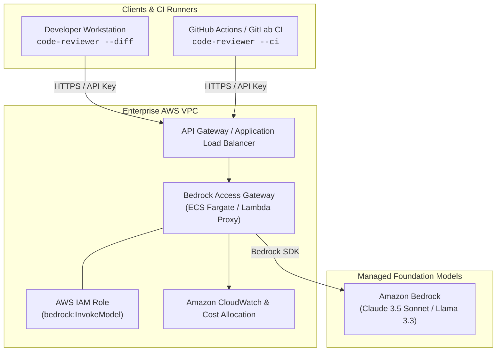

# AWS Bedrock Access Gateway Pattern for code-reviewer

In enterprise environments with strict security, compliance, and multi-tenant billing requirements, deploying a **centralized AWS Bedrock Access Gateway** is often preferred over running per-runner sidecars or granting AWS IAM access directly to every developer workstation and CI job.

This guide explains how the Bedrock Access Gateway pattern works and how to configure `code-reviewer` to use it.

---

## Architecture Overview

An AWS Bedrock Access Gateway is a centralized proxy service (hosted on AWS ECS Fargate, AWS Lambda with API Gateway, or Amazon EKS) that provides an OpenAI-compatible API endpoint (`/v1/chat/completions`) backed by Amazon Bedrock.



---

## Why Use an Access Gateway?

| Feature | Access Gateway Pattern | Per-Runner Sidecar (LiteLLM) |
|---|---|---|
| **Credential Distribution** | Zero AWS IAM credentials distributed to developers or CI runners. Uses organization API tokens. | Requires AWS credentials or OIDC IAM roles on every runner. |
| **Network Security** | Can be restricted to internal VPC / PrivateLink endpoints. | Requires public AWS API egress or VPC runner setup. |
| **Cost & Usage Tracking** | Centralized tagging, rate limiting, and cost allocation per team/repository. | Distributed across individual runner executions. |
| **Audit & Governance** | Centralized audit logging of all code review prompts and token counts. | Dispersed across pipeline run logs. |

---

## 1. Configuring code-reviewer for the Gateway

Since `code-reviewer` natively speaks the OpenAI REST format via `--api-url`, connecting to an Access Gateway is straightforward.

### CLI Usage

```bash
code-reviewer --diff \
  --api-url https://bedrock-gateway.corp.internal/v1 \
  --api-key "${GATEWAY_API_KEY}" \
  --model anthropic.claude-3-5-sonnet-20241022-v2:0
```

### In `.code-reviewer.yaml`

Configure repository defaults in `.code-reviewer.yaml`:

```yaml
api_url: https://bedrock-gateway.corp.internal/v1
model: anthropic.claude-3-5-sonnet-20241022-v2:0
focus: [bugs, security, performance]
min_severity: low
chunk_strategy: split
```

Then export the environment variable before running:

```bash
export REVIEW_API_KEY="corp-key-xyz"
code-reviewer --diff
```

---

## 2. CI/CD Integration Examples

### GitHub Actions

Because the Access Gateway manages AWS authentication internally, your GitHub Actions workflow only needs the gateway URL and secret token:

```yaml
name: Enterprise Code Review
on:
  pull_request:
    types: [opened, synchronize]

permissions:
  contents: read
  pull-requests: write

jobs:
  review:
    runs-on: ubuntu-latest
    steps:
      - uses: actions/checkout@v4
        with:
          fetch-depth: 0

      - name: Run code-reviewer
        uses: OpticDiff/code-reviewer-action@v1
        with:
          model: anthropic.claude-3-5-sonnet-20241022-v2:0
          extra-args: >-
            --api-url https://bedrock-gateway.corp.internal/v1
            --api-key ${{ secrets.BEDROCK_GATEWAY_TOKEN }}
        env:
          GITHUB_TOKEN: ${{ secrets.GITHUB_TOKEN }}
```

### GitLab CI

```yaml
stages:
  - review

code-review:
  stage: review
  image: ghcr.io/opticdiff/code-reviewer:0.7.0
  rules:
    - if: $CI_PIPELINE_SOURCE == "merge_request_event"
  variables:
    REVIEW_API_URL: "https://bedrock-gateway.corp.internal/v1"
    REVIEW_API_KEY: $BEDROCK_GATEWAY_TOKEN
    REVIEW_MODEL: "anthropic.claude-3-5-sonnet-20241022-v2:0"
    GITLAB_TOKEN: $CODE_REVIEWER_TOKEN
    REVIEW_COMMENT_MODE: "discussions"
  script:
    - code-reviewer --ci --incremental
  allow_failure: true
```

---

## 3. Gateway Architecture Implementation Options

Organizations typically implement the Bedrock Access Gateway using one of two approaches:

1. **ECS Fargate / EKS with LiteLLM Proxy or vLLM**:
   - Run containerized LiteLLM with a shared PostgreSQL database for key management, spend tracking, and rate limiting.
   - Attach an AWS IAM Task Role with `bedrock:InvokeModel`.
   - Expose via AWS Application Load Balancer with TLS termination and AWS WAF.

2. **Serverless API Gateway + AWS Lambda**:
   - Deploy an API Gateway with an HTTP integration to a Lambda handler running an OpenAI-to-Bedrock translation layer.
   - Ideal for variable workloads with scale-to-zero economics.
