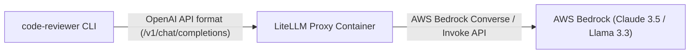

# Using code-reviewer with AWS Bedrock via LiteLLM Proxy

[LiteLLM](https://github.com/BerriAI/litellm) is a lightweight proxy that provides an OpenAI-compatible API layer in front of 100+ LLM backends, including **AWS Bedrock**.

Since `code-reviewer` natively supports any OpenAI-compatible endpoint via the `--api-url` flag, you can use LiteLLM to seamlessly review code using foundation models hosted on AWS Bedrock (such as Anthropic Claude 3.5 Sonnet, Amazon Nova, and Meta Llama 3.3).

---

## Architecture Overview



---

## 1. Prerequisites

1. **AWS Bedrock Model Access**: Ensure the desired models (e.g., Anthropic Claude 3.5 Sonnet, Amazon Nova Pro) are enabled in your AWS Bedrock console (e.g., `us-east-1` or `us-west-2`).
2. **AWS IAM Permissions**: Your AWS credentials or IAM role must have the `bedrock:InvokeModel` and `bedrock:InvokeModelWithResponseStream` permissions.

---

## 2. Local Setup

### Step 1: Start the LiteLLM Proxy

You can run LiteLLM locally using Docker. AWS credentials are passed from your environment:

```bash
docker run -d --name litellm-proxy \
  -p 4000:4000 \
  -e AWS_ACCESS_KEY_ID="${AWS_ACCESS_KEY_ID}" \
  -e AWS_SECRET_ACCESS_KEY="${AWS_SECRET_ACCESS_KEY}" \
  -e AWS_REGION_NAME="us-east-1" \
  ghcr.io/berriai/litellm:main-latest \
  --port 4000
```

Alternatively, install and launch LiteLLM with Python:

```bash
pip install 'litellm[proxy]'
litellm --port 4000
```

### Step 2: Run code-reviewer

Execute `code-reviewer` targeting your local LiteLLM proxy:

```bash
code-reviewer --diff \
  --api-url http://localhost:4000/v1 \
  --model bedrock/anthropic.claude-3-5-sonnet-20241022-v2:0
```

You can also persist this in `.code-reviewer.yaml`:

```yaml
api_url: http://localhost:4000/v1
model: bedrock/anthropic.claude-3-5-sonnet-20241022-v2:0
focus: [bugs, security]
min_severity: low
```

---

## 3. CI/CD Integration

### GitHub Actions (with OIDC)

In GitHub Actions, start LiteLLM as a step after AWS authentication so it inherits the OIDC-derived credentials:

```yaml
name: Bedrock Code Review
on:
  pull_request:
    types: [opened, synchronize]

permissions:
  contents: read
  id-token: write
  pull-requests: write

jobs:
  review:
    runs-on: ubuntu-latest

    steps:
      - uses: actions/checkout@v4
        with:
          fetch-depth: 0

      - name: Configure AWS Credentials via OIDC
        uses: aws-actions/configure-aws-credentials@v4
        with:
          role-to-assume: ${{ secrets.AWS_ROLE_ARN }}
          aws-region: us-east-1
          audience: sts.amazonaws.com

      # Start LiteLLM after AWS auth so it gets the credentials
      - name: Start LiteLLM proxy
        run: |
          docker run -d --name litellm \
            -p 4000:4000 \
            -e AWS_ACCESS_KEY_ID="${AWS_ACCESS_KEY_ID}" \
            -e AWS_SECRET_ACCESS_KEY="${AWS_SECRET_ACCESS_KEY}" \
            -e AWS_SESSION_TOKEN="${AWS_SESSION_TOKEN}" \
            -e AWS_REGION_NAME="us-east-1" \
            ghcr.io/berriai/litellm:main-latest \
            --port 4000
          for i in $(seq 1 30); do
            curl -sf http://localhost:4000/health && break || sleep 2
          done

      - name: Run code-reviewer
        uses: OpticDiff/code-reviewer-action@v1
        with:
          model: bedrock/anthropic.claude-3-5-sonnet-20241022-v2:0
          extra-args: "--api-url http://localhost:4000/v1"
        env:
          GITHUB_TOKEN: ${{ secrets.GITHUB_TOKEN }}
```

### GitLab CI (with AWS IAM OIDC)

> **Note**: GitLab CI supports [OIDC authentication to AWS](https://docs.gitlab.com/ee/ci/cloud_services/aws/).
> Configure an AWS IAM OIDC identity provider for your GitLab instance, then use `web_identity_token_file`
> in your CI job. See the linked docs for the full setup.

```yaml
stages:
  - review

bedrock-review:
  stage: review
  image: ghcr.io/opticdiff/code-reviewer:0.7.0
  services:
    - name: ghcr.io/berriai/litellm:main-latest
      alias: litellm
  rules:
    - if: $CI_PIPELINE_SOURCE == "merge_request_event"
  variables:
    AWS_DEFAULT_REGION: "us-east-1"
    REVIEW_API_URL: "http://litellm:4000/v1"
    REVIEW_MODEL: "bedrock/anthropic.claude-3-5-sonnet-20241022-v2:0"
    GITLAB_TOKEN: $CODE_REVIEWER_TOKEN
    REVIEW_COMMENT_MODE: "discussions"
    # AWS credentials: use CI/CD variables (Settings > CI/CD > Variables)
    # Set AWS_ACCESS_KEY_ID, AWS_SECRET_ACCESS_KEY as masked/protected variables
    # Or configure OIDC: https://docs.gitlab.com/ee/ci/cloud_services/aws/
  script:
    - code-reviewer --ci --incremental
  allow_failure: true
```

---

## 4. Supported AWS Bedrock Models

LiteLLM routes to Bedrock models using the `bedrock/<model-id>` syntax:

| Bedrock Model | LiteLLM Model Identifier | Recommended Use Case |
|---|---|---|
| **Anthropic Claude 3.5 Sonnet v2** | `bedrock/anthropic.claude-3-5-sonnet-20241022-v2:0` | Premier coding quality, deep bug finding |
| **Anthropic Claude 3.5 Haiku** | `bedrock/anthropic.claude-3-5-haiku-20241022-v1:0` | High-speed, lower-cost PR reviews |
| **Amazon Nova Pro** | `bedrock/amazon.nova-pro-v1:0` | Enterprise general code analysis |
| **Meta Llama 3.3 70B Instruct** | `bedrock/meta.llama3-3-70b-instruct-v1:0` | Open-weights frontier model on AWS |
